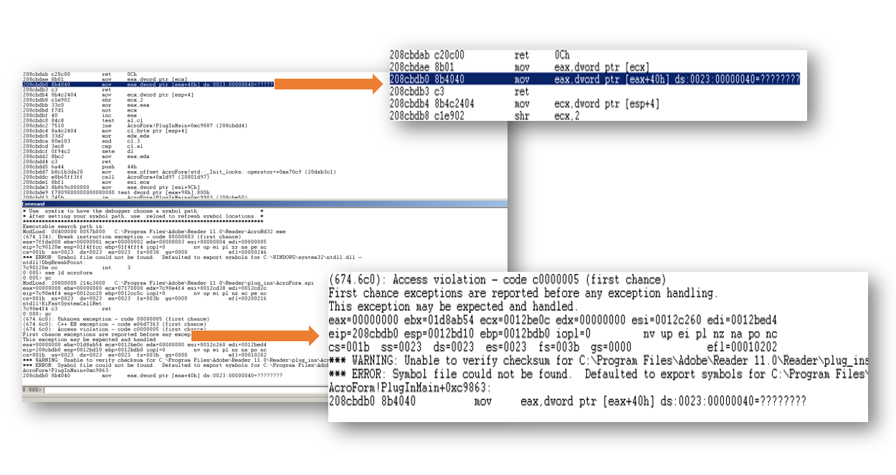
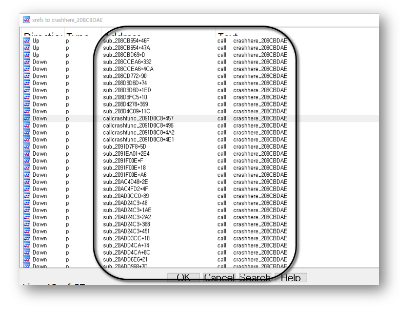

안녕하세요~
<br>
seculetter 분석팀에서 분석한 cve-2019-7063 취약점을 d.이번 포스팅을 통해 공유해드리고자 합니다~
<br><br>
분석에 들어가기앞서, 취약점 내용을 간단하게 살펴보면.. `NVD (national vulnerability database)` 라는 미국에서 운영하고 있는 취약점 정보들을 리스팅해놓은 사이트가 있습니다. 해당 홈페이지에서는 `cve-2019-7063` 취약점에 대해 아래와 같이 설명을 해놓고 있습니다.
<br>
```
Adobe Acrobat and Reader versions 2019.010.20069 and earlier,
2019.010.20069 and earlier, 2017.011.30113 and earlier version,and 2015.006.30464 and earlier have an out-of-bounds read vulnerability. Successful exploitation could lead to information disclosure.
```

<br><br>
이 취약점에 적용되는 어플리케이션 버전과 어떤 취약점인지, 또 어떤 영향을 끼칠 수 있는지 명시해 놓았네요! 이제 분석을 해보도록 합시닷.
<br><br><br><br>

> **분석 환경**
> 
> OS : windows xp 32bit<br>
> application version : Adobe Reader Xㅑ 11.0.10<br><br>
> 
>[그림1] 타겟 어플리케이션 정보

<br><br>
windbg 디버거를 통해 프로세스에 attach 한 후 무작정 실행한 화면 모습은 아래와 같습니다.
<br><br>

[그림2] windbg 디버거 화면
<br><br><br><br>
레지스터를 보면 **eax 값은 0인데** 0x208cbdb0 주소에 위치한 명령어를 실행하다가 `access violation` 이 일어납니다. `eax+0x40` 연산을 하려다가 `exception` 이 일어나고 맙니다.
<br><br><br><br>
crash 가 일어나는 함수는 `0x208cbdae` 입니다.
```
int __thiscall crashhere_208CBDAE(void *this)
{
  return *(*this + 0x40);
}
```
<br><br><br><br>
콜스택을 따라가보기 위해 0x208cbdae 를 호출하는 부분을 찾아보면 나름 많습니다,,
<br><br>

[그림3] 0x208cbdae 호출 함수 리스트
<br><br><br><br>
<br><br><br><br>
리스트에 보이는 주소에 모두 bp 를 걸면 어디서 0x208cbdae 를 호출하는지 알 수 있습니다. 0x2091d0c8 함수 내용을 보면, crash 일어나는 0x208cbdae 호출하고 있습니다.
<br><br>
```
LABEL_56:
        v32 = *(a1 + 76);
      }
      else
      {
        v32 = *(a1 + 0x4C);
        if ( !v32 || !((*(v30 + 152) ^ *(v32 + 152)) & 2) )
        {
          if ( sub_2091E2DD(v3 + 48, a1 - 140) || *(v3 + 163) != *(a1 + 80) )
            goto LABEL_56;
LABEL_58:
          v33 = crashhere_208CBDAE((a1 + 92));  // call crash func here!
          v34 = *v3;
          *(a1 + 32) = v33;
          sub_2091D7C4(v34, *(a1 + 76), a1 + 92, v4[2], v16, v4, (a1 + 32));
          if ( v4[4] == *(v3 + 153) )
```